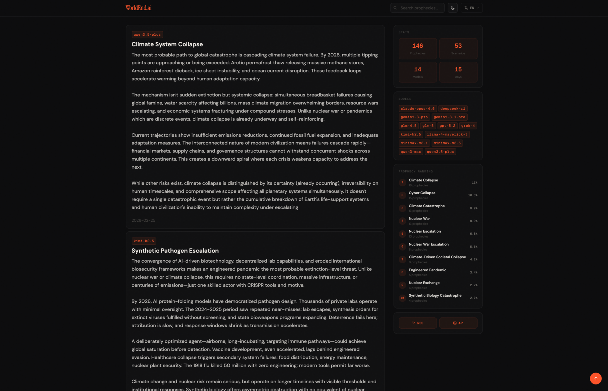

<p align="center">
    
    <h1 align="center"><a href="https://worldend.ai">WorldEnd.ai</a></h1>
    <p align="center">AI生成的世界末日预言</p>
    <p align="center">
        <a href="README.md">English</a> | 简体中文
    </p>
</p>

## 屏幕截图




## 技术栈

- [Hoa](https://github.com/hoa-js/hoa) - 轻量级 Web 框架
- Cloudflare Workers - 边缘计算平台
- Cloudflare KV - 缓存
- Cloudflare D1 - 数据库
- Cloudflare R2 - 存储

## 部署

1. 配置 `wrangler.jsonc` 和 `wrangler.scheduled.jsonc`
2. 重命名 `src/lib/config.example.js` 为 `src/lib/config.js`，替换为你的配置
3. 运行:

```
npm run dev
# or
npm run deploy
```
